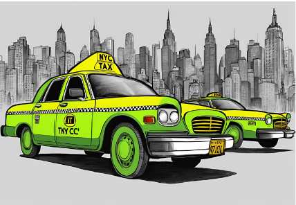

# NYC TLC Green Cab Revenue Maximization

## Overview

The NYC TLC Green Cab Revenue Maximization project aims to enhance revenue for New York City's green cabs by optimizing fleet allocation based on detailed demand pattern analysis. By strategically aligning resources with peak demand times and locations, this project seeks to improve service efficiency, reduce passenger wait times, and maximize profitability for cab operators.

## Features

- **Demand Pattern Analysis**: Comprehensive analysis of historical trip data to identify peak demand times and high-traffic zones across NYC.
- **Fleet Optimization**: Strategies to optimize fleet distribution, ensuring that vehicles are available where and when they are needed most.
- **Revenue Insights**: Data-driven insights into revenue trends, allowing for informed decision-making and strategic planning.
- **Interactive Visualizations**: Tableau dashboards providing a visual representation of demand patterns, enabling intuitive understanding and actionable insights. Q1 2023 Revenue Dashboard: https://public.tableau.com/views/TLCNYCGreenTaxiRevenueDashboard/TLCNYCGreenTaxiRevenueDashboard?:language=en-GB&:sid=&:redirect=auth&:display_count=n&:origin=viz_share_link
## Objectives

- **Maximize Revenue**: Increase revenue by aligning fleet operations with demand, focusing on high-demand areas like Manhattan and specific zones such as East Harlem.
- **Improve Customer Satisfaction**: Enhance service delivery through reduced wait times and better availability, leading to increased customer satisfaction and retention.
- **Operational Efficiency**: Streamline operations by minimizing deadheading and optimizing driver schedules according to demand patterns.

## Implementation

1. **Data Collection**: Gather and clean trip data from NYC TLC databases, focusing on key metrics such as pickup location, time, and revenue.
2. **Demand Analysis**: Use Python and Tableau to analyze and visualize demand patterns, identifying peak times and zones.
3. **Fleet Allocation Strategy**: Develop a dynamic allocation strategy based on analytical insights, adjusting vehicle distribution and driver shifts.
4. **Performance Monitoring**: Implement KPIs and dashboard in Tableau to monitor performance, making data-driven adjustments as necessary.

## Technologies Used

- **Python**: For data cleaning and initial analysis.
- **Tableau**: To create interactive dashboards and visualizations.
- **GitHub**: For version control and collaboration.

## Getting Started

1. **Clone the Repository**:
   ```bash
   git clone https://github.com/ireneselena/Capstone_2_NYC_TLC_Green_Taxis.git


## Contribute

If you'd like to contribute, feel free to contact me here:

<a href="https://www.linkedin.com/in/ireneselena/" target="_blank">
    
  </a>
  <a href="mailto:ireneselenam@gmail.com" target="_blank">
    
  </a>
